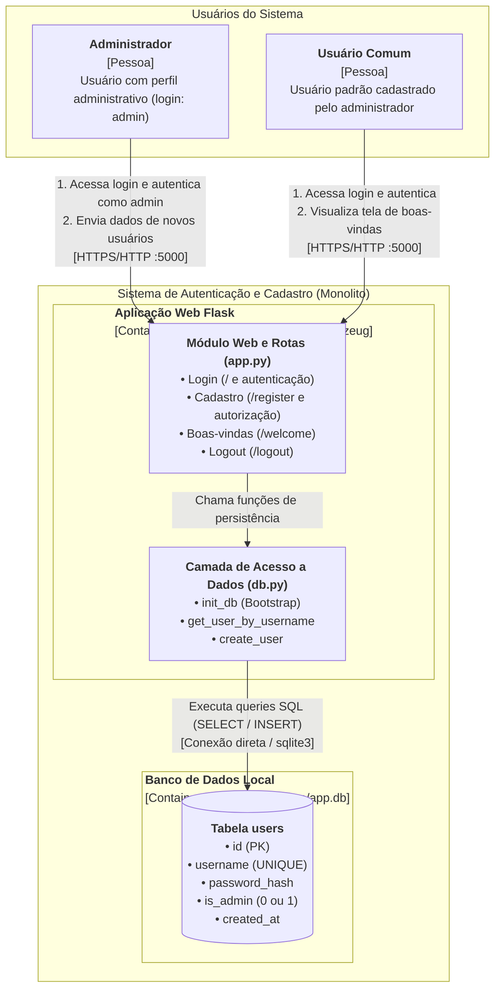

# Diagrama C4 — Nível 2: Container (v1)

**Data:** 2026-09-13  
**Projeto:** Aplicação Web de Autenticação e Cadastro de Usuários  
**Escopo:** Representação dos contêineres e limites de execução reais da aplicação.

---

## 1. Diagrama de Contêineres (C4 Container)

---

## 2. Descrição dos Elementos

### 2.1. Pessoas (Atores)
- **Administrador (`admin`):** Usuário inicial persistido automaticamente no SQLite com `is_admin = 1`. Realiza login e gerencia a criação exclusiva de novos usuários comuns.
- **Usuário Comum:** Usuário cadastrado pelo administrador (`is_admin = 0`). Realiza login e acessa exclusivamente a página de boas-vindas.

### 2.2. Contêineres de Software
- **Aplicação Web Flask (`Python 3 + Flask`):**
  - **Tecnologias:** Python 3, Flask, Jinja2 (templates HTML), Werkzeug (hash seguro de senha com PBKDF2/scrypt), Sessão Flask em cookie seguro.
  - **Responsabilidade:** Receber requisições HTTP, validar dados de entrada, controlar sessões de autenticação, aplicar regras de autorização (`@admin_required`, `@login_required`) e renderizar as páginas web.
  - **Estrutura interna:**
    - [`app.py`](file:///home/josemberg/Documentos/MESTRADO/DEV-ia/tarefa3/app.py): Controlador das rotas HTTP, validação e sessão.
    - [`db.py`](file:///home/josemberg/Documentos/MESTRADO/DEV-ia/tarefa3/db.py): Inicialização do banco, bootstrap do `admin` e funções de consulta/inserção.
- **Banco de Dados SQLite (`instance/app.db`):**
  - **Tecnologia:** SQLite 3 (banco relacional local baseado em arquivo).
  - **Responsabilidade:** Persistência transacional dos registros de usuários na tabela `users`, garantindo unicidade de `username` e armazenamento seguro de senhas com hash.

### 2.3. Relações e Protocolos
1. **Navegador Web ➔ Aplicação Flask (`HTTP :5000`):** Envio de formulários POST de login e cadastro, e recebimento de HTML renderizado e cookies de sessão (`session`).
2. **Aplicação Flask ➔ SQLite (`Driver sqlite3 nativo`):** Conexão direta em arquivo local com consultas parametrizadas contra SQL Injection e tratamento de exceções de integridade (`sqlite3.IntegrityError`).

