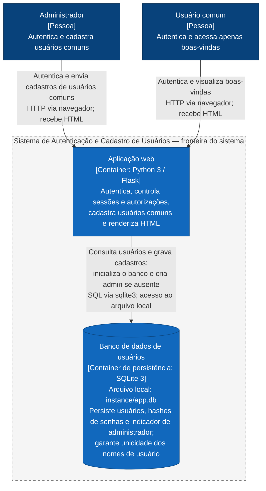

# Arquitetura atual — C4 Container (nível 2)

Diagrama baseado na implementação atual de [app.py](../../app.py), [db.py](../../db.py) e na [decisão de modularização interna](../decisao-arquitetural-etapa4.md). A notação Mermaid `flowchart` representa os elementos e relações do nível C4 Container.

Existem dois containers dentro da fronteira: a aplicação web, unidade executável, e o banco SQLite, unidade de persistência. O SQLite é embarcado e acessado como arquivo local; sua representação não implica um servidor ou processo separado. Container C4 não implica uso de Docker.

A aplicação usa Jinja2 para renderizar HTML e Werkzeug para gerar e verificar hashes de senha. `app.py` e `db.py` integram a mesma aplicação em execução. Páginas, rotas, funções, templates e tabelas são detalhes internos e não aparecem como containers. O navegador é o meio de interação dos atores, indicado nas relações.

Após autenticação, o administrador é direcionado ao cadastro, que sempre cria usuários comuns. O usuário comum é direcionado às boas-vindas e tem o acesso ao cadastro bloqueado. A inicialização persiste o administrador inicial somente quando ele ainda não existe.
